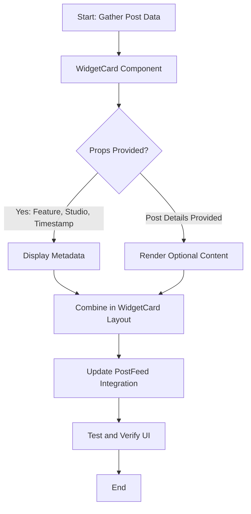

# WidgetCard Component Redesign Planning

This document outlines the plan for reengineering the post card UI into a dedicated widget component called "WidgetCard". This component is based on Bubble's idea for modular widget components.

## 1. Create the WidgetCard Component

- **Location:** `src/components/post/WidgetCard.tsx`
- **Design:** Utilize existing Card primitives from `src/components/ui/card.tsx` to ensure consistency.
- **Displayed Metadata:** 
  - **Feature:** e.g., Progress, Stats.
  - **Studio:** e.g., Bonobo Gym, Friskis & Svettis, Kvarnholmen Boxing.
  - **Last Updated:** Timestamp formatted appropriately.
- **Optional Content:** Accommodate an optional area for post details if provided as children.
- **Style:** Remove engagement interactions (upvotes, downvotes, comments, sharing, saving) and maintain a clean, widget-like appearance.

## 2. Update PostFeed Integration

- **File:** `src/components/post/PostFeed.tsx`
- **Task:** Replace the current card usage for posts with the new WidgetCard component.
- **Mapping:** Ensure that post data provides the necessary props (feature, studio, last updated, and optionally post details) to WidgetCard.

## 3. UX Considerations

- **Consistency:** Leverage Bubble’s visual themes and Tailwind CSS classes as used in the existing UI.
- **Flexibility:** The widget should be easily customizable in the future (e.g., via the sidebar menu) as part of Bubble’s widget-based approach.
- **Future Enhancements:** The current design will facilitate adding customization options later.

## 4. Testing and Verification

- Render posts using the WidgetCard.
- Confirm that metadata displays correctly.
- Validate that optional content is rendered only when provided.

## Mermaid Diagram of the Workflow

---

This plan provides a clear, modular approach to reengineering the card component into a widget. Once approved, implementation will proceed accordingly in Code mode.